# Introduction

## What is MPS?

* The [JetBrains Meta-Programming System](https://www.jetbrains.com/mps/) is a
  workbench for creating domain-specific languages (DSLs)
* Programs written in MPS DSLs are not stored as raw text: instead, they are
  stored as abstract syntax trees (ASTs)
* This makes it easier to compose languages, e.g. create an extension of Java
  which new statements that are translated on the fly

## What is this session about?

* 2022 MDENet Symposium had an excellent intro to MPS from [Vaclav Pech](https://mde-network.com/annual-symposium-2022-recordings/). Quick refresher:
  * MPS project = languages + solutions
  * Language = set of modules, including:
    * Structure: concept definitions
    * Editors: concept presentation
    * Constraints, Typesystem: validation
    * Textgen: model-to-text (M2T)
    * Generator: model-to-model (M2M)
* In this session, we focus on **generators**

## MPS transformation pipelines

* MPS has a very strong focus on code generation as the ultimate goal
* Starting from a model, we apply 0+ M2M txs, and end with 1 M2T tx
* It is still possible to produce multiple outputs from a model, but
  these require some
  [gymnastics](https://www.f1re.io/multi-generators) or reconfiguring
  our model

## Materials

* Available from [Github](https://github.com/agarciadom/mps-m2m-mdenet-training)
* Implements 4 toy languages:
  * `dot`: Graphviz [Dot](https://graphviz.org/doc/info/lang.html)-like; has Textgen
  * `graph`: graphs and edges; no Textgen
  * `sql_ddl`: tables, columns and foreign keys; has Textgen
  * `tree`: nested tree nodes; no Textgen
* `full-version` tag has finished versions of all transformations

# Graph to Dot

## Graph language

:::::::::::::: {.columns}
::: {.column width="20%"}

:::
::: {.column width="80%"}

* `Graph` is the rootable concept
* Inside, we have `nodes` and `edges`
* We have a working editor with a nice syntax
* We do not have a Textgen module, though: we'll have to transform it to a
  language that does have one

:::
::::::::::::::

## Dot language

* `DirectedGraph` is the rootable concept, which contains `IStatement`s
* `IStatement`s can be default edge/graph/node assignments, or edge/node
  creation statements
* This DSL does have a Textgen, so it's a good target language for our M2M tx

## Before we do anything...

Let's try to generate text!

Right-click on the input model and selecting "Preview Generated Text":

## Oops, nothing useful

Indeed, no text was produced at all:

We do need that Generator module.

## Preparation: inter-language dependencies

First, ensure that `graph` depends on `dot`:

## Creating the Generator

We'll add a generator to `graph`:

We'll call it `graph2dot`.

## Generator module

We have now a generator module (G icon) with a generator model (marked as
`@generator`).

The generator model only contains a mapping configuration (arrow icon), which is
the starting point of an MPS M2M transformation.

## Mapping configurations

* MCs have rules of various types, each with their own mini-DSLs: the most
  common ones are *root mapping* and *reduction rules*
* Let's try to implement this transformation with those two types

From now on, I'll switch between slides and live demo, as describing the
non-standard interactions with MPS in slides would take a while!

## Root mapping

* Creates model roots: note that the input node does not have to be a root!
* Requires a root template, which is any root in the generator model that is not
  from a concept in the generator language
* We need to add `dot` to the languages used by the generator model
* Afterwards, we can just create a `DirectedGraph` inside the generator model

## Root template (v1)

* We customise the name of the digraph
* Set `Graph` as input type to help with type checks
* Note: the `root template` part is actually an annotation - it's not part of
  the `DirectedGraph` object itself

## Adding root mapping to MC

* We add the root mapping to the MC
* This says "consume any Graph and turn it into a DirectedGraph"

## Preview generated text (v1)

* If you try to preview the generated text, you'll get something at least.
* Still not very useful, though: we need actual nodes and edges here!

## Root template (v2)

* Let's populate the root template a bit more, so it's closer to what we want:
  we add examples of nodes and edges
* A fixed output model is not very useful, though!

## Node and property macros

* MPS follows a template-like approach for specifying M2M transformations
* Dynamic model sections are specified via *macros*:
  * **Node macros** produce subtrees for the AST
  * **Property macros** compute the value of a specific property in an AST node
  * **Reference macros** compute a reference to an object in an AST node
* We create them by selecting a node/property and using Alt+Enter to trigger the
  appropriate *intention* (an in-place M2M transformation)

## COPY_SRC(L) node macros

{height=350px}

* We'll "copy" the input objects into the output, after they are reduced to
  compatible types.
* Tip: keep the bottom right Inspector pane open!

## Reduction rule: node to node

* We use an in-line template to create the dot `NodeCreationStatement` from the graph `Node`
* Note that non-root templates need to have "template regions" (marked as `<T T>`): everything else is ignored

## Property macro: node name

We use a property macro to replace the fixed "n" name with one computed from the node.

## Reduction rule: edge to edge

* We create another reduction rule, this time from the graph `Edge`s to the dot `Edge`s.
* The inline template produces an edge from the placeholder `n` node to itself.
* We need to use reference macros to compute the source/target references to the
  dot `Node`s that were reduced from the graph `Node`s

## Mapping labels: concept

* The Edge reduction rule needs the dot `Node` produced from the graph `Node`
  * This is the same problem tackled by `equivalent()` in ETL/ATL
* In MPS, this is done through *mapping labels*:
  1. Define the label in the mapping configuration
  1. Ensure there are rules creating the association
  1. Use the label from the `genContext` passed to a macro

## Mapping labels: definition

* We add a new mapping label to the mapping configuration
* We can choose any name we want: here we went for something descriptive
* Mapping labels are typesafe: we specify both the input and output types

## Mapping labels: population

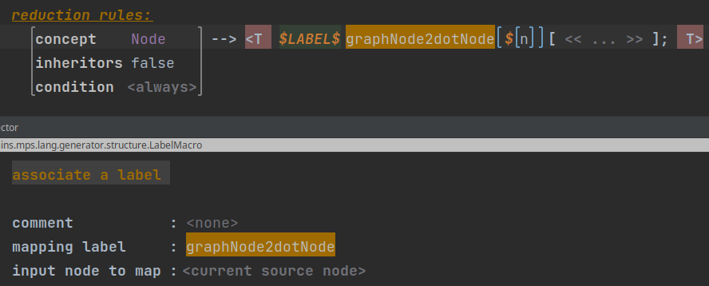

* We use the LABEL node macro to associate the generated graph `Node` with the source dot `Node`

## Mapping labels: use

* Reference macros can use the `get output X for (Y)` method in `genContext`
* Note that this special syntax is reduced into pure Java by MPS built-in languages

## Extra touch: graph name

{height=400px}

We add a property graph to name the dot graph after the original graph.

## Done!

* We can now make the generator, and try previewing the generated files
* We'll get the digraph file from the graph that we expected

# Tree to Graph (reductions)

## Tree language

:::::::::::::: {.columns}
::: {.column width="20%"}

:::
::: {.column width="80%"}

* `Tree` is the only concept
* It is a more restricted version of the `Graph` DSL, really
* It would be nice to reuse the M2M from `Graph` to visualize these
* We'll use a separate generator-only language to try approaches

:::
::::::::::::::

## tree2graph.reduction language

* We create a new language without any concepts
* We declare it "extends" `tree` and `graph`
* We tell the generator model to use `graph`
* The language only provides a generator from `tree` to `graph`

## Root template (v1)

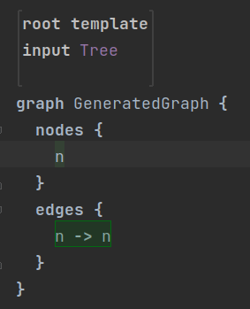

For now, we just produce a fixed graph.

## Root mapping rule

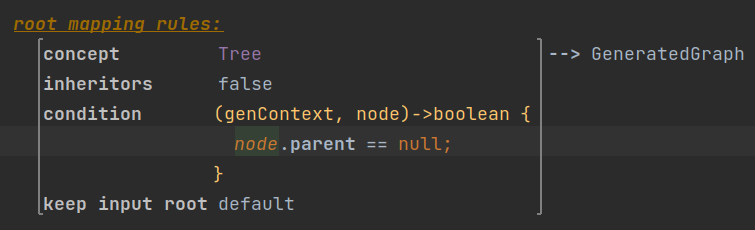

We use a condition to only map the root `Tree`.

## Engaging the generator

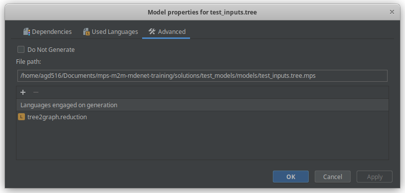{height=300px}

* By default, MPS will only use the generators of the languages instantiated in the model
* We need to tell `tree` to use `tree2graph.reduction` during generation

## Root template (v2)

:::::::::::::: {.columns}
::: {.column width="50%"}

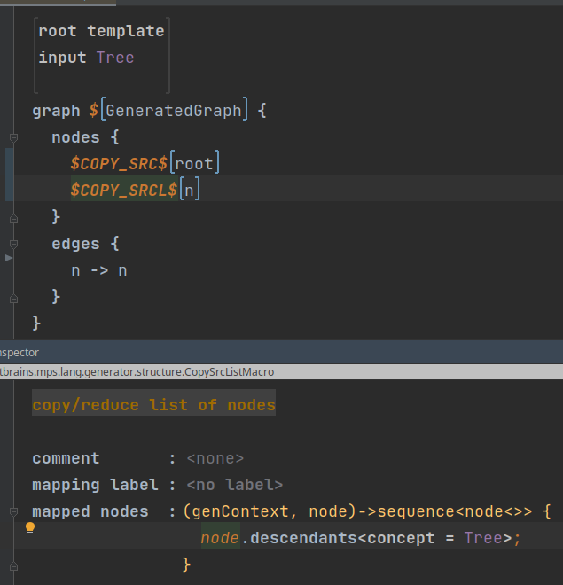{height=450px}

:::
::: {.column width="50%"}

* We can use reduction to map trees to graph nodes
* We can also use mapping labels to track this reduction
* We can only reduce nodes once: what do we do for the edges?

:::
::::::::::::::

## Root template (v3)

{height=450px}

We use LOOP to map inner nodes into edges.

## Root template (v3 target)

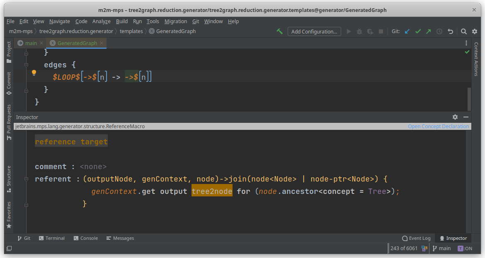{height=400px}

We use the `ancestor` [SModel](https://www.jetbrains.com/help/mps/smodel-language.html) operation to fetch the parent `Tree` in a typesafe manner.

# Tree to Graph (weaving)

## Weaving rules

* Weaving rules allow for inserting nodes at arbitrary places of the output
  model (e.g. for utility methods)
* We'll create a different generator language which uses weaving rules instead:
  `tree2graph.weaving`

## Root template

* This graph is empty!
* We'll add nodes and edges via weaving rules

## Weaving template for nodes

Only the parts in template fragments are added.

## Weaving rule for nodes

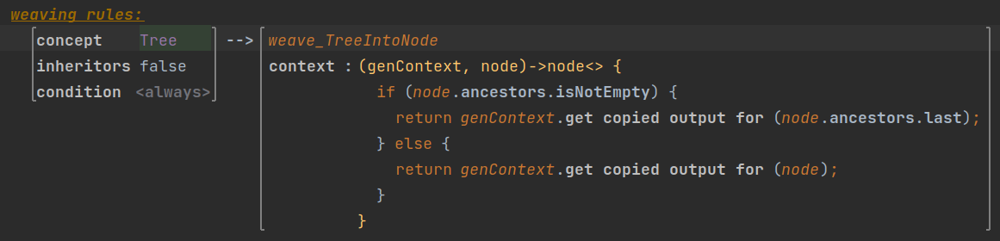

* We use code to insert the new node into the Graph produced from the
  root of that Tree.
* Using `get copied output`, we don't need a mapping label.

## Weaving template for edges

## Weaving rule for edges

# Tree to Graph (conditional roots)

## Conditional roots

* These allow for creating new roots from scratch, instead of mapping
  an existing root
* Can be useful for creating a single Graph that brings all Tree
  objects together
* We'll start by copying `tree2graph.reduction`

## Root template: copying nodes

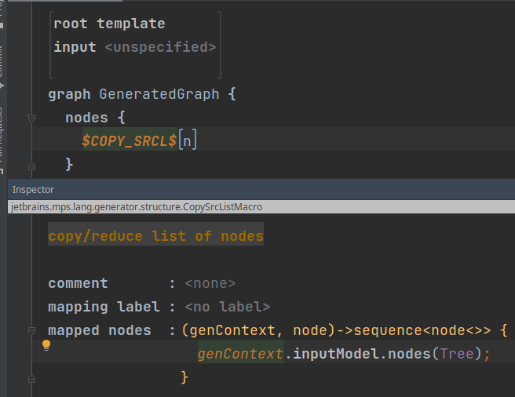

## Root template: looping for edges

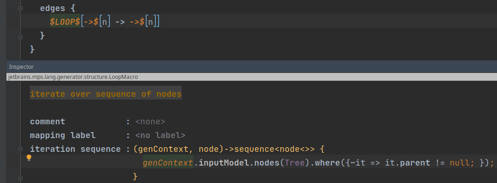

## Replacing root mapping with conditional root

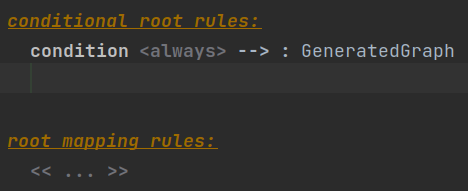

In theory, we should be done, but...

## Avoiding warnings from multiple output mappings

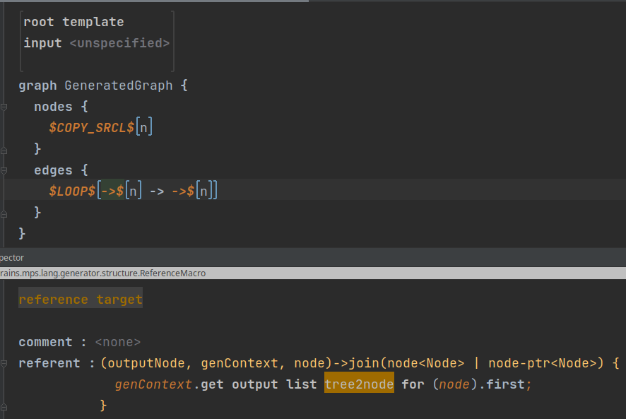{height=400px}

Not sure why this is needed!

# Closing

## What did we use?

* Root mapping, conditional root, reduction, and weaving rules
* `COPY_SRCL`, `LABEL`, and `LOOP` node macros
* Property and reference macros
* Mapping labels
* ... and a lot of Alt+Enter and Ctrl+Space :-)

## What did we miss?

* Accessory models and utility classes
* Devkits
* Generation plans
* Language extension
* Other rules (abandon roots, patterns, etc.)
* Pre/post-processing scripts
* Template switches
* ... and probably quite more!

## Other resources to learn MPS

* [MDENet community](https://community.mde-network.org/spaces/7191327/content)
* [Fast Track to MPS](https://www.jetbrains.com/help/mps/fast-track-to-mps.html)
* [Markus Voelter's intro course](https://github.com/markusvoelter/mpsintrocourse)
* [HeavyMeta.tv](https://heavymeta.tv/)

## Thank you!

Antonio Garcia-Dominguez

a.garcia-dominguez AT york.ac.uk

[@antoniogado@fosstodon.org](https://fosstodon.org/@antoniogado)

[\@antoniogado](http://twitter.com/antoniogado)
